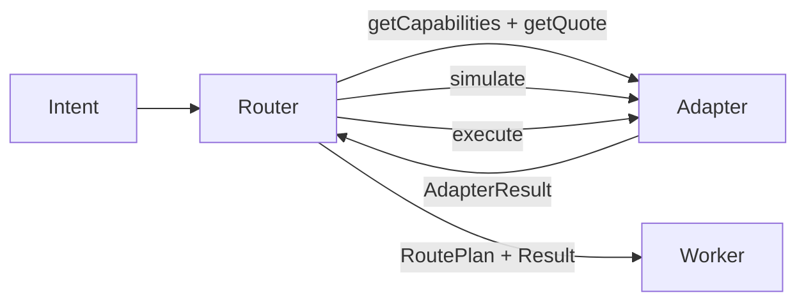

# Creating a New Adapter

This guide walks you from the [`@keeta-agent-stack/adapter-template`](../packages/adapter-template)
boilerplate to a real venue adapter that the routing engine, policy engine,
and dashboards can use.

## Mental Model

Every adapter implements a `VenueAdapter` (DEX, anchor bridge, or transfer
rail). The routing engine never calls a venue's underlying API directly — it
only calls the adapter's typed contract:



Adapters are pure with respect to ledger state in `mode: 'simulate'`, and
must be idempotent on `intentId` in `mode: 'live'`.

## Step 1 — Copy the Template

```bash
cp -r packages/adapter-template packages/adapter-myvenue
```

In `packages/adapter-myvenue/package.json`:

- rename `"name"` to `@keeta-agent-stack/adapter-myvenue`
- bump `"version"` to `0.0.1`

Then link the new package into the workspace:

```bash
pnpm install
```

## Step 2 — Implement the Contract

Open `packages/adapter-myvenue/src/template-adapter.ts` (rename the file to
match your venue if you want). Each method maps to a routing-engine guarantee:

| Method                | Purpose                                                          | Notes                                                                   |
| --------------------- | ---------------------------------------------------------------- | ----------------------------------------------------------------------- |
| `id`                  | Stable identifier used by routes, audit logs, and routing weights | Lowercase kebab-case, e.g. `binance-usdt-spot`                         |
| `kind`                | `'dex' \| 'anchor' \| 'transfer'`                                | Drives default capability discovery                                    |
| `healthCheck()`       | Report liveness                                                  | Cheap. Used for adapter-health dashboards.                              |
| `getCapabilities()`   | Advertise supported pairs + features                             | Static is fine; refresh on a timer if your venue listings change         |
| `supportsPair(b, q)`  | Fast path filter for the router                                  | Pure boolean check                                                       |
| `getQuote(req)`       | Return a `QuoteResponse` or a structured `AdapterErr`            | No side-effects. Wrap upstream errors in `err('UPSTREAM_5XX', msg)`.    |
| `execute(ctx)`        | Settle a route step                                              | Idempotent on `ctx.intentId`. Honour `ctx.mode`.                        |

Use the helpers from `@keeta-agent-stack/adapter-base`:

```ts
import { ok, err } from '@keeta-agent-stack/adapter-base';
return ok(quote);
return err('UNSUPPORTED_PAIR', 'Pair not listed');
```

## Step 3 — Write Tests

There are two test layers:

1. The **shared contract suite** at
   `@keeta-agent-stack/adapter-base/contract`:

   ```ts
   import { runAdapterContractSuite } from '@keeta-agent-stack/adapter-base/contract';
   import { MyVenueAdapter } from './my-venue-adapter.js';

   runAdapterContractSuite(new MyVenueAdapter(), {
     supportedBase: 'KTA',
     supportedQuote: 'USDC',
     unsupportedBase: 'NOPE',
     unsupportedQuote: 'PAIR',
   });
   ```

   This asserts the adapter speaks valid `AdapterHealth`, `CapabilityMap`,
   `QuoteResponse`, and `ExecutionResult`. Run it once both `getQuote` and
   `execute(simulate)` are real.

2. The **conformance suite**
   (`@keeta-agent-stack/adapter-base/conformance`) which adds latency/cancellation
   coverage. Wire it in once your live path is stable.

If your `execute` path is still throwing (like the
`@keeta-agent-stack/adapter-solana-stub`), skip the contract suite and write
targeted tests instead — see
[`packages/adapter-template/src/template-adapter.test.ts`](../packages/adapter-template/src/template-adapter.test.ts).

## Step 4 — Register the Adapter

Edit
[`packages/adapter-registry/src/factory.ts`](../packages/adapter-registry/src/factory.ts).

Pattern: gate every non-mock or experimental adapter behind an env flag so it
never auto-loads in production. Mock adapters use the convention
`KEETA_ENABLE_<NAME>=true`.

```ts
import { MyVenueAdapter } from '@keeta-agent-stack/adapter-myvenue';
// inside createDefaultDevAdapters
if (MyVenueAdapter.isEnabled()) {
  adapters.push(new MyVenueAdapter({ /* config */ }));
}
```

Add the package to `packages/adapter-registry/package.json` dependencies:

```json
"@keeta-agent-stack/adapter-myvenue": "workspace:*"
```

## Step 5 — Routing Weights (Optional, Recommended)

If your adapter has an ops profile (priority, success rate, p95 latency,
bond status), surface it through the standard
`RouteStepRoutingContext` so the route scorer can reflect operator quality:

- See `packages/types/src/schemas/route.ts` for the canonical fields.
- Populate them in `getQuote()` (for quoting) and let the worker mirror them
  on the `RouteStep` it persists.

## Step 6 — Update the Capability Matrix

Add a row to [`docs/capability-matrix.md`](./capability-matrix.md) under
**Rails / Adapters** describing:

- the package name
- which paths are real vs. stubbed
- the `KEETA_ENABLE_*` env flag (if any)

## Step 7 — Verify

```bash
pnpm --filter @keeta-agent-stack/adapter-myvenue typecheck
pnpm --filter @keeta-agent-stack/adapter-myvenue test
pnpm --filter @keeta-agent-stack/adapter-myvenue build
pnpm --filter @keeta-agent-stack/adapter-registry typecheck
pnpm --filter @keeta-agent-stack/adapter-registry test
```

Then dry-run the publish surface to make sure the package is shippable:

```bash
pnpm --filter @keeta-agent-stack/adapter-myvenue publish --dry-run --no-git-checks
```

## Reference Implementations

| Pattern                                | Package                                    | Notes                                                            |
| -------------------------------------- | ------------------------------------------ | ---------------------------------------------------------------- |
| Documented boilerplate (throws live)   | [`adapter-template`](../packages/adapter-template) | Copy this first.                                                |
| Working in-memory mock DEX             | [`adapter-mock-dex`](../packages/adapter-mock-dex) | Spread + slippage simulation.                                   |
| Working in-memory CLOB-style mock CEX  | [`adapter-mock-cex`](../packages/adapter-mock-cex) | Per-pair books, balances, fills. Env-flagged.                  |
| Documented stub (live throws)          | [`adapter-solana-stub`](../packages/adapter-solana-stub) | Quote + simulate work; live throws `SolanaNotImplementedError`. |
| Real native rail                        | [`adapter-keeta-transfer`](../packages/adapter-keeta-transfer) | Reference for production patterns.                              |
| Real anchor bridge                      | [`adapter-mock-anchor`](../packages/adapter-mock-anchor)        | Pattern for asynchronous settlement.                             |

## Why "throw on execute" is safe

The routing engine treats `NOT_IMPLEMENTED` errors and adapter-thrown
exceptions as soft failures. The adapter remains visible for capability
discovery, dashboards, and policy authoring, but it is never selected for
live settlement. This lets you ship a documented stub that route designers
can experiment with before the real on-chain code is finished.
