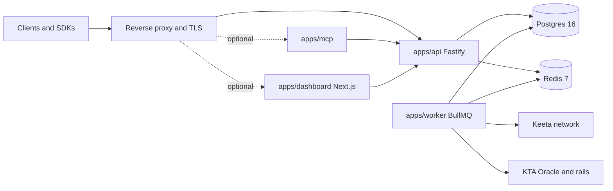

# Deployment Guide

This guide walks operators from a local dev stack to a hardened production
deployment of the Keeta Agent SDK. It covers topology, environment, scaling,
security, observability, zero-downtime rollouts, and platform-specific
recipes.

For local development see the root [README](../README.md) and
[`docker-compose.yml`](../docker-compose.yml). For an adapter-only deployment
view see [`docs/creating-new-adapter.md`](./creating-new-adapter.md). For the
SDK + OpenAPI surface see [`docs/sdk-reference.md`](./sdk-reference.md).

## Topology

Production is five processes plus two stateful services. Everything else
(MCP, dashboard, oracle relays) is optional and can be scaled independently.



| Component         | Process                 | State                | Scale dim                |
| ----------------- | ----------------------- | -------------------- | ------------------------ |
| API               | `pnpm --filter @keeta-agent-sdk/api start`     | stateless            | replicas behind LB        |
| Worker            | `pnpm --filter @keeta-agent-sdk/worker start`  | stateless (Redis lease) | concurrency + replicas |
| Dashboard         | `pnpm --filter @keeta-agent-sdk/dashboard start` | stateless           | replicas behind LB        |
| MCP (optional)    | `pnpm --filter @keeta-agent-sdk/mcp start`     | stateless            | per-LLM tenant            |
| Postgres          | `postgres:16-alpine`    | durable              | vertical, then read replicas |
| Redis             | `redis:7-alpine`        | ephemeral (queues)   | vertical, then cluster   |

## Compose vs Kubernetes vs Swarm

| Need                                       | Compose | Kubernetes | Swarm  |
| ------------------------------------------ | :-----: | :--------: | :----: |
| Single VM / small ops team                 |   Yes   | Overkill   |  Yes   |
| Per-service rolling updates                | Manual  |    Yes     |  Yes   |
| Horizontal autoscaling                     |   No    |    Yes     | Limited |
| Secrets manager integration (KMS, Vault)   | Manual  |    Yes     | Manual |
| Multi-region failover                      |   No    |    Yes     |  No    |
| Already running BullMQ in cluster mode     |  Manual | First-class | Limited |

Pick **Compose** for staging/POC, **Kubernetes** for any live-money deployment.

## Production-critical environment

Mirror [`.env.example`](../.env.example) and override the values below.
Highlighted variables are **required** in production:

| Variable                                | Why it matters                                                 |
| --------------------------------------- | -------------------------------------------------------------- |
| `NODE_ENV=production`                   | Disables dev-only auth shortcuts                              |
| `DATABASE_URL`                          | Use TLS + pooled connections (see Postgres tuning)             |
| `REDIS_URL`                             | Use TLS; keep DB for queues isolated from app caches           |
| `LIVE_MODE_ENABLED=true`                | Required to leave simulate-only mode                           |
| `EXECUTION_KILL_SWITCH=false`           | Flip to `true` to halt all live executes immediately           |
| `OPS_API_KEY`                           | Server-side only; never exposed to the browser                 |
| `AUTH_JWT_*` (one of secret/JWKS/OIDC)  | Replaces dev-mode bypass auth                                  |
| `AUTH_ALLOW_LEGACY_OPS_API_KEY=false`   | Forces JWT for operators in production                         |
| `AUTH_ALLOW_ADMIN_BYPASS_IN_PRODUCTION=false` | Disables `ADMIN_BYPASS_TOKEN` unless audited and intentional |
| `MCP_ALLOW_INLINE_SEEDS=false`          | Forces the worker-held seed; keeps signing material out of MCP |
| `KEETA_SIGNING_SEED`                    | Worker-only; load from KMS / sealed secret                     |
| `KEETA_NETWORK=main`                    | Pin the Keeta network                                          |
| `LOG_LEVEL=info`                        | Plus `LOG_REDACT_EXTRA` for any custom secret keys             |
| `METRICS_ENABLED=true` + `METRICS_REQUIRE_AUTH=true` | Prometheus scrape behind auth                       |
| `OTEL_ENABLED=true` + `OTEL_EXPORTER_OTLP_ENDPOINT` | Tracing into your collector                          |
| `KEETA_POLICY_ENABLED=true` + `IDENTITY_POLICY_ENABLED=true` (when applicable) | Hardened policy preflight |
| `ANCHOR_BOND_STRICT=true`               | Reject live anchor steps without bond proofs                   |

Full env reference (including BullMQ timeouts, operator metrics knobs, and
policy caps) lives in [`.env.example`](../.env.example).

## BullMQ Scaling

The worker reads jobs from Redis via BullMQ. Tune in three places:

1. **Per-stage timeouts**: `JOB_TIMEOUT_MS_QUOTE`, `JOB_TIMEOUT_MS_ROUTE`,
   `JOB_TIMEOUT_MS_POLICY`, `JOB_TIMEOUT_MS_EXECUTE`,
   `JOB_TIMEOUT_MS_ANCHOR_BOND_RECONCILE`,
   `JOB_TIMEOUT_MS_ANCHOR_ONBOARDING`. Defaults are conservative; raise only
   if your venues legitimately need it.
2. **Concurrency**: number of worker replicas + per-process concurrency. The
   worker is stateless; horizontal scale is preferred.
3. **Stuck-job sweep**: `STUCK_JOB_SWEEP_INTERVAL_MS` and
   `STUCK_JOB_AGE_MS`. Combine with `WORKER_SHUTDOWN_TIMEOUT_MS` so SIGTERM
   doesn't strand in-flight executes.

Operational tip: dedicate one Redis logical DB to BullMQ to keep queue
metrics from drifting against unrelated caches.

## Postgres Tuning

- Run migrations on every deploy: `pnpm --filter @keeta-agent-sdk/api migrate`
  (or your equivalent CI step). Migrations live in
  [`infrastructure/migrations`](../infrastructure/migrations).
- Pool: set `max_connections` ≥ `(api_replicas * api_pool) + (worker_replicas * worker_pool)`.
  Start with API pool 10, worker pool 5.
- Hot-path indexes are pre-shipped (`0010_hot_path_indexes.sql`); audit
  query plans before hand-rolling new ones.
- Take a logical backup before each migration that touches the
  `intents`/`executions`/`webhook_deliveries` tables.
- For multi-AZ deploys, use a managed Postgres (RDS, Cloud SQL, Neon) with
  automated PITR.

## Security Hardening

- TLS terminates at the edge proxy. Inside the network always use
  `OPS_API_KEY` + JWT bearer; never `x-ops-key` alone in production.
- Rotate `OPS_API_KEY` and `KEETA_SIGNING_SEED` on a schedule via your secret
  manager (Vault, AWS Secrets Manager, Doppler).
- Webhooks use HMAC; validate the signature server-side and reject anything
  older than a few minutes (replay protection).
- The worker is the **only** process that touches `KEETA_SIGNING_SEED`.
  Apply network policies/security groups to deny that env from leaking into
  API or dashboard pods.
- Dashboard uses the server-only `DASHBOARD_V2_ENABLED` flag — never expose
  via `NEXT_PUBLIC_*`. See the dashboard security addendum in the dashboard
  README.
- Set `LOG_REDACT_EXTRA=token,authorization,cookie` (and any custom keys)
  to extend the pino redact list.

## Observability

- **Metrics**: enable `METRICS_ENABLED=true` and scrape `/metrics`. Required
  charts: queue depth per stage, p95 stage latency, intent terminal
  outcomes, webhook delivery success rate, anchor bond reconcile lag.
- **Tracing**: `OTEL_ENABLED=true` with an OTLP collector. The API and
  worker propagate intent IDs through context.
- **Logging**: pino JSON to stdout. Aggregate via your log platform; never
  `console.log` secrets.
- **Health checks**:
  - Liveness: `GET /healthz`
  - Readiness: `GET /readyz` (verifies Postgres + Redis)
  - Worker readiness: BullMQ heartbeat in Redis (covered by the worker
    metrics endpoint)
- **Operator alerts** (suggested): `EXECUTION_KILL_SWITCH=true`, queue depth
  growth > 5min, anchor bond reconcile failures, webhook delivery > 50%
  failure over a window.

## Zero-downtime Rollouts

1. Migrate Postgres first; migrations are additive.
2. Roll API replicas with a 30s drain (`SIGTERM` → finish in-flight requests
   → exit before `WORKER_SHUTDOWN_TIMEOUT_MS`).
3. Roll worker replicas one at a time; BullMQ leases will failover to
   healthy peers.
4. Roll dashboard last so users always see a backend-compatible UI.
5. Use a feature flag (e.g. `LIVE_MODE_ENABLED`) for risky changes — flip
   in config rather than redeploying.

## Platform Recipes

### Railway / Render

- One service per process (`api`, `worker`, optional `dashboard`, optional `mcp`).
- Add a managed Postgres + managed Redis from the same provider.
- Set the env vars from the table above. Add health checks for `/healthz`
  on the API service.

### Fly.io

- `fly.toml` per app: separate `api` and `worker` apps so you can scale
  them independently. Use Fly Postgres + Upstash Redis (or Fly's managed
  Redis) for proximity.
- Set `auto_stop_machines = false` for the worker.

### AWS ECS (Fargate)

- One task definition per process. Use ECS Service Connect to give the API
  a stable hostname for the worker's internal callbacks.
- Use Aurora Postgres + ElastiCache Redis. Store secrets in AWS Secrets
  Manager and inject via task IAM.
- Front the API with ALB; set health check path `/healthz`. Run worker as
  a separate service with a desired count of N.

### Kubernetes (Helm skeleton below)

- Use a Helm chart per process; share a values file for the env block.
- HPA on the API on CPU/RPS; HPA on the worker on BullMQ queue depth via
  KEDA (`bullmq-scaler`).
- Use a `PodDisruptionBudget` (`minAvailable: 1`) for both API and worker.

## Hosted sandbox (Fly.io)

The repo ships ready-to-use Fly configs for deploying the API, worker, and
MCP against Keeta testnet:

- [`apps/api/fly.toml`](../apps/api/fly.toml) — public HTTPS, healthchecked.
- [`apps/worker/fly.toml`](../apps/worker/fly.toml) — internal-only, holds
  `KEETA_SIGNING_SEED` (no other process should).
- [`apps/mcp/fly.toml`](../apps/mcp/fly.toml) — stdio MCP, runnable behind
  an HTTP/SSE bridge if you need to expose it remotely.

Sandbox defaults are intentionally conservative:

- `KEETA_NETWORK=test` — pinned to Keeta testnet, never mainnet.
- `MCP_ALLOW_INLINE_SEEDS=false` — agents cannot pass raw seeds; signing
  has to go through the worker via `OPS_API_KEY`-gated control-plane tools.
- API stays effectively read-only for unauthenticated callers; mutating
  endpoints require `OPS_API_KEY` (or `ADMIN_BYPASS_TOKEN` for dev).

First-time bootstrap:

```bash
fly apps create keeta-agent-sandbox-api
fly apps create keeta-agent-sandbox-worker
fly apps create keeta-agent-sandbox-mcp
fly postgres create --name keeta-agent-sandbox-pg
fly postgres attach --app keeta-agent-sandbox-api keeta-agent-sandbox-pg
fly redis create --name keeta-agent-sandbox-redis   # or use Upstash

fly secrets set --app keeta-agent-sandbox-api  OPS_API_KEY=...
fly secrets set --app keeta-agent-sandbox-worker \
  DATABASE_URL=... REDIS_URL=... KEETA_SIGNING_SEED=...
fly secrets set --app keeta-agent-sandbox-mcp \
  KEETA_API_URL=https://keeta-agent-sandbox-api.fly.dev OPS_API_KEY=...

fly deploy --config apps/api/fly.toml
fly deploy --config apps/worker/fly.toml
fly deploy --config apps/mcp/fly.toml
```

Suggested public URL: `sandbox.keeta-agent-sdk.dev` (CNAME to the API
Fly app). Document the URL in the root `README.md` once it is live.

## Starter `docker-compose.prod.yml`

A working version lives at the repo root as
[`docker-compose.prod.yml`](../docker-compose.prod.yml) — populate
`.env.production`, then run
`docker compose -f docker-compose.yml -f docker-compose.prod.yml up -d --build`.
The snippet below is kept for reference / Helm comparison.

```yaml
services:
  api:
    image: ghcr.io/your-org/keeta-agent-api:${KEETA_API_IMAGE_TAG:-latest}
    env_file: .env.production
    depends_on:
      postgres:
        condition: service_healthy
      redis:
        condition: service_healthy
    healthcheck:
      test: ['CMD', 'wget', '-q', '-O', '-', 'http://localhost:3001/healthz']
      interval: 10s
      timeout: 5s
      retries: 10
    deploy:
      replicas: 2
      restart_policy:
        condition: on-failure
    ports:
      - '3001:3001'

  worker:
    image: ghcr.io/your-org/keeta-agent-worker:${KEETA_WORKER_IMAGE_TAG:-latest}
    env_file: .env.production
    depends_on:
      postgres:
        condition: service_healthy
      redis:
        condition: service_healthy
    deploy:
      replicas: 2
      restart_policy:
        condition: on-failure

  dashboard:
    image: ghcr.io/your-org/keeta-agent-dashboard:${KEETA_DASHBOARD_IMAGE_TAG:-latest}
    env_file: .env.production
    depends_on:
      - api
    ports:
      - '3000:3000'

  mcp:
    image: ghcr.io/your-org/keeta-agent-mcp:${KEETA_MCP_IMAGE_TAG:-latest}
    env_file: .env.production
    depends_on:
      - api

  postgres:
    image: postgres:16-alpine
    environment:
      POSTGRES_USER: ${POSTGRES_USER}
      POSTGRES_PASSWORD: ${POSTGRES_PASSWORD}
      POSTGRES_DB: ${POSTGRES_DB}
    volumes:
      - keeta_pg:/var/lib/postgresql/data
      - ./infrastructure/postgres/init.sql:/docker-entrypoint-initdb.d/init.sql:ro
    healthcheck:
      test: ['CMD-SHELL', 'pg_isready -U ${POSTGRES_USER} -d ${POSTGRES_DB}']
      interval: 5s
      timeout: 5s
      retries: 10

  redis:
    image: redis:7-alpine
    command: ['redis-server', '--save', '60', '1', '--appendonly', 'yes']
    volumes:
      - keeta_redis:/data
    healthcheck:
      test: ['CMD', 'redis-cli', 'ping']
      interval: 5s
      timeout: 5s
      retries: 10

volumes:
  keeta_pg:
  keeta_redis:
```

## Helm Skeleton

```yaml
apiVersion: v2
name: keeta-agent
description: Keeta Agent SDK (api + worker + dashboard + mcp)
type: application
version: 0.1.0
appVersion: '0.1.0'
```

```yaml
replicaCount:
  api: 2
  worker: 2
  dashboard: 2
  mcp: 1

image:
  repository: ghcr.io/your-org/keeta-agent
  tag: latest
  pullPolicy: IfNotPresent

env:
  NODE_ENV: production
  LIVE_MODE_ENABLED: 'true'
  EXECUTION_KILL_SWITCH: 'false'
  KEETA_NETWORK: main
  METRICS_ENABLED: 'true'
  METRICS_REQUIRE_AUTH: 'true'
  OTEL_ENABLED: 'true'
  AUTH_ALLOW_LEGACY_OPS_API_KEY: 'false'
  AUTH_ALLOW_ADMIN_BYPASS_IN_PRODUCTION: 'false'
  MCP_ALLOW_INLINE_SEEDS: 'false'

secrets:
  databaseUrl: ''           # set via Helm --set or external secret
  redisUrl: ''
  opsApiKey: ''
  keetaSigningSeed: ''      # worker-only mount
  authJwtSecret: ''
  otelExporterOtlpEndpoint: ''

postgres:
  enabled: false            # use a managed instance in production
redis:
  enabled: false            # use a managed instance in production

probes:
  api:
    liveness: /healthz
    readiness: /readyz
  worker:
    liveness: /healthz

autoscaling:
  api:
    enabled: true
    minReplicas: 2
    maxReplicas: 10
    targetCPUUtilizationPercentage: 60
  worker:
    enabled: true
    minReplicas: 2
    maxReplicas: 20
    keda:
      bullmq:
        host: ${REDIS_HOST}
        queues: [quote, route, policy, execute, anchor]
        threshold: '50'

podDisruptionBudget:
  api:
    minAvailable: 1
  worker:
    minAvailable: 1
```

Use this as the starting point for a real chart under `charts/keeta-agent`;
flesh out the `Deployment`, `Service`, and `HorizontalPodAutoscaler` (or
KEDA `ScaledObject`) templates from this values shape.

## Where to next

- Adapter authoring: [docs/creating-new-adapter.md](./creating-new-adapter.md)
- Capability matrix: [docs/capability-matrix.md](./capability-matrix.md)
- SDK + OpenAPI: [docs/sdk-reference.md](./sdk-reference.md)
- MCP / LLM integration: [examples/mcp-llm-integration.md](../examples/mcp-llm-integration.md)
